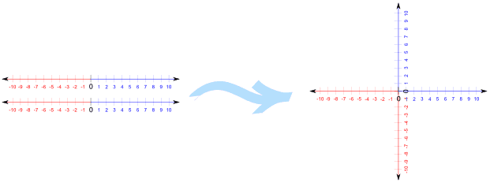

## Chapter 13

* Correlation and Regression
* Presented by: Sherri Verdugo, M.S.
* Instructor, CSUF Sociology Department
* Class: Soc 303

---

## Prologue

Regression and Correlation evaluate the strength of a relationship between variables. This time we are looking at interval or ratio levels of measurement. Our question of interest is: "What is the strength of t he relationship between the variables" for at least two variables. This time, we are looking at making a prediction. We do this using the techniques presented in Chapter 13 and Chapter 14. 

First we introduce a correlation coefficient, to ascertain the magnitude of relationship between two variables. If the value is large enough, we generate a linear regression equation. The larger our correlation coefficient, the more accurate the predictions will be. 

For example, does variable x have a relationship with variable y? Can we make a prediction about the variable from given information?

---

## Setting up 

When is correlation-regression analysis used?

Info.  | Outcome
-------|--------
Given  | $\;$ Two individual (raw score) variables measured by interval/ratio scales
Task   | $\;$ Measure the strength of the relationship between variables
Output | $\;$ If that relationship is sufficiently strong, describe the nature of the relationship between the two variables in such a way that it will be possible to predict a respondent's score on one variable if we know that person's score on the other variable

---

## Example of data used for Regression

```{r,  ex1, results='markup', eval=TRUE, echo=TRUE}
data(iris)
head(iris)

```


---


## Example from textbook pg. 445

We might be interested in other data besides Iris information. For example, we might want to look at political corruption:

Employee | x       | y 
---------|---------|---
1        | $\;$ 80 | $\;$ 160
2        | $\;$ 70 | $\;$ 95
3        | $\;$ 52 | $\;$ 97
4        | $\;$ 45 | $\;$ 85

* x = Annual income (in thousands of US dollars)
* y = Mean Monthly contribution in US dollars

* Question: does a relationship exist between annual income and mean monthly contribution?
* Question: how strong is the relationship?
* Question: can we make a prediction?
* Question: what is the prediction?

---

## Introduction of terms:

* Correlation Coefficient [page 446]: 
     * Measure of strength of a relationship in which data are not grouped in tables but are individual raw scores.
* Pearson's Product-Moment Correlation Coefficient (a.k.a. Pearson's r) [page 446]:
     * Coefficient that is used when both variables are an interval or a ratio level of measurement.
* Coefficient of Determination ($r^2$) [page 446]:
     * Indicates the proportion of variation in the dependent variable (y) that can be explained by variation in the independent variable (x).
* Regression Equation [page 447]:
     * the mechanism for estimating a y score from the respective x score.
* Correlation-regression Analysis [page 447]:
     * The presentation of correlation and regression techniques together.

---


## Graphs

### Cartesian coordinates

Sometimes we need to plot the data and we have some key terms that we need to understand:

* Cartesian Plots and Coordinates [page 447]:
     * A pictoral representation of the relationship between two or more variables under study. This method was developed by Rene Descartes.
* Origin of a Graph [page 448]:
     * The point of a graph where the two axes intersect indicating a value of zero on each axis.
* x-axis [page 448]:
     * the axis that extends horizontally.
* y-axis [page 448]:
     * the axis that extends vertically.
* Ordered Pair [page 450]:
     a set of two numbers in parentheses separated by a comma, indicating a point on a graph.
* x-coordinate [page 450]:
     * the first number in an ordered pair
* y-coordinate [page 450]:
     * the second number in an ordered pair

---

## Cartesian Coordinates Review



We put two number lines together in a single plot. 

* x = horizontal
* y = vertical

---

## Cartesian Coordinates Review


* Quadrant I: x is positive and y is positive
* Quadrant II: x is negative and y is positive
* Quadrant III: x is negative and y is negative
* Quadrant IV: x is positive and y is negative

---

## Cartesian Coordinates Review


Look at the origin and the coordinates.

* We have x = 6
* We have y = 4

---

## The concept of linearity

### Key terms: 

* Function [page 452]:
     * The case where a score on the dependent variable (y) may be predicted from a score on the independent variable (x). The value of (y) is obtained either graphically or by an equation.
* Linearity (linear related) [page 452]:
     * Relationship that is shown as an exact straight line.

## Example of a linear relationship

Respondents | $\;$ x  |  $\;$ y
------------|---------|--------
Daryl       | $\;$ 0  | $\;$ 0
Carol       | $\;$ 4  | $\;$ 2
Maggie      | $\;$ 8  | $\;$ 4
Glenn       | $\;$ 12 | $\;$ 6
Abraham     | $\;$ 16 | $\;$ 8
Rick        | $\;$ 20 | $\;$ 10

x = Education and y = Total Savings in thousands of dollars

```{r linear1, results='markup', eval=TRUE, echo=TRUE}
library(ggplot2)
education=as.numeric(c(0,4,8,12,16,20))
savings=as.numeric(c(0,2,4,6,8,10))
row.names=c("Daryl", "Carol", "Maggie", "Glenn", "Abraham", "Rick")
walking=data.frame(cbind(row.names,education, savings))
walking
w=qplot(education, savings)
w+ annotate("text", x=education, y=savings, label=c("Daryl", "Carol", "Maggie", "Glenn", "Abraham", "Rick"), size=2, hjust=-.35, vjust=-.35)
```


Add a line to the graph

```{r linear2, results='markup', eval=TRUE, echo=TRUE}
library(ggplot2)
education=as.numeric(c(0,4,8,12,16,20))
savings=as.numeric(c(0,2,4,6,8,10))
row.names=c("Daryl", "Carol", "Maggie", "Glenn", "Abraham", "Rick")
walking=data.frame(cbind(row.names,education, savings))
walking
w=qplot(education, savings)
w+stat_smooth(method="lm")
```


---

## Examples: Diamonds

```{r diamonds, results='markup', eval=TRUE, echo=TRUE}
library(ggplot2)
data(diamonds)
head(diamonds,4)
```

## Cartesian Plots

```{r diamondsplot1, results='markup', eval=TRUE, echo=TRUE}
qplot(carat, price, data=diamonds, color=clarity)

```


---

