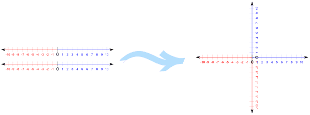
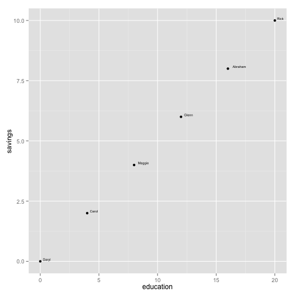
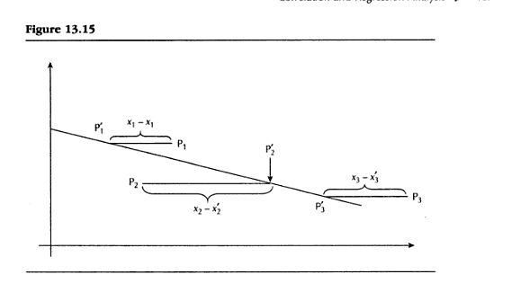
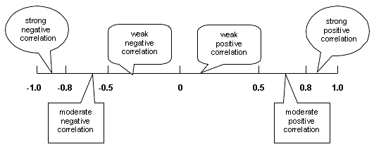
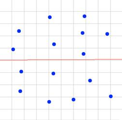
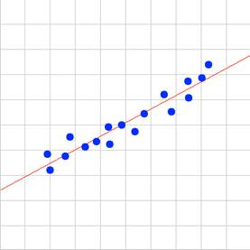
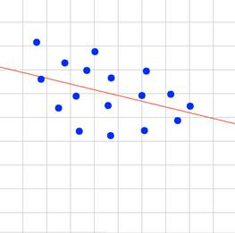
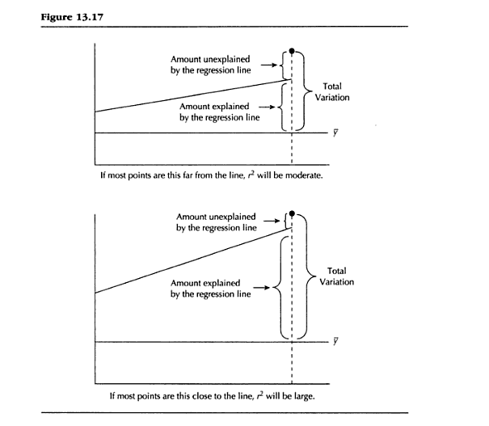

## Chapter 13

* Correlation and Regression
* Presented by: Sherri Verdugo, M.S.
* Instructor, CSUF Sociology Department
* Class: Soc 303

---

## Prologue

Regression and Correlation evaluate the strength of a relationship between variables. This time we are looking at interval or ratio levels of measurement. Our question of interest is: "What is the strength of t he relationship between the variables" for at least two variables. This time, we are looking at making a prediction. We do this using the techniques presented in Chapter 13 and Chapter 14. 

First we introduce a correlation coefficient, to ascertain the magnitude of relationship between two variables. If the value is large enough, we generate a linear regression equation. The larger our correlation coefficient, the more accurate the predictions will be. 

For example, does variable x have a relationship with variable y? Can we make a prediction about the variable from given information?

---

## Setting up 

When is correlation-regression analysis used?

Info.  | Outcome
-------|--------
Given  | $\;$ Two individual (raw score) variables measured by interval/ratio scales
Task   | $\;$ Measure the strength of the relationship between variables
Output | $\;$ If that relationship is sufficiently strong, describe the nature of the relationship between the two variables in such a way that it will be possible to predict a respondent's score on one variable if we know that person's score on the other variable

---

## Example of data used for Regression


```r
data(iris)
head(iris)
```

```
#   Sepal.Length Sepal.Width Petal.Length Petal.Width Species
#          5.1         3.5          1.4         0.2  setosa
#          4.9         3.0          1.4         0.2  setosa
#          4.7         3.2          1.3         0.2  setosa
#          4.6         3.1          1.5         0.2  setosa
#          5.0         3.6          1.4         0.2  setosa
#          5.4         3.9          1.7         0.4  setosa
```


---

## Example from textbook pg. 445

We might be interested in other data besides Iris information. For example, we might want to look at political corruption:

Employee | x       | y 
---------|---------|---
1        | $\;$ 80 | $\;$ 160
2        | $\;$ 70 | $\;$ 95
3        | $\;$ 52 | $\;$ 97
4        | $\;$ 45 | $\;$ 85

* x = Annual income (in thousands of US dollars)
* y = Mean Monthly contribution in US dollars

* Question: does a relationship exist between annual income and mean monthly contribution?
* Question: how strong is the relationship?
* Question: can we make a prediction?
* Question: what is the prediction?

---

## Introduction of terms:

* Correlation Coefficient [page 446]: 
     * Measure of strength of a relationship in which data are not grouped in tables but are individual raw scores.
* Pearson's Product-Moment Correlation Coefficient (a.k.a. Pearson's r) [page 446]:
     * Coefficient that is used when both variables are an interval or a ratio level of measurement.
* Coefficient of Determination ($r^2$) [page 446]:
     * Indicates the proportion of variation in the dependent variable (y) that can be explained by variation in the independent variable (x).
* Regression Equation [page 447]:
     * the mechanism for estimating a y score from the respective x score.
* Correlation-regression Analysis [page 447]:
     * The presentation of correlation and regression techniques together.

---

## Graphs

### Cartesian coordinates

Sometimes we need to plot the data and we have some key terms that we need to understand:

* Cartesian Plots and Coordinates [page 447]:
     * A pictorial representation of the relationship between two or more variables under study. This method was developed by Rene Descartes.
* Origin of a Graph [page 448]:
     * The point of a graph where the two axes intersect indicating a value of zero on each axis.
* x-axis [page 448]:
     * the axis that extends horizontally.
* y-axis [page 448]:
     * the axis that extends vertically.
* Ordered Pair [page 450]:
     a set of two numbers in parentheses separated by a comma, indicating a point on a graph.
* x-coordinate [page 450]:
     * the first number in an ordered pair
* y-coordinate [page 450]:
     * the second number in an ordered pair


---

## Cartesian Coordinates Review



We put two number lines together in a single plot. 

* x = horizontal
* y = vertical

---

## Cartesian Coordinates Review


* Quadrant I: x is positive and y is positive
* Quadrant II: x is negative and y is positive
* Quadrant III: x is negative and y is negative
* Quadrant IV: x is positive and y is negative

---

## Cartesian Coordinates Review


Look at the origin and the coordinates.

* We have x = 6
* We have y = 4

---

## The concept of linearity

### Key terms: 

* Function [page 452]:
     * The case where a score on the dependent variable (y) may be predicted from a score on the independent variable (x). The value of (y) is obtained either graphically or by an equation.
* Linearity (linear related) [page 452]:
     * Relationship that is shown as an exact straight line.

---

## Example of a linear relationship

Respondents | $\;$ x  |  $\;$ y
------------|---------|--------
Daryl       | $\;$ 0  | $\;$ 0
Carol       | $\;$ 4  | $\;$ 2
Maggie      | $\;$ 8  | $\;$ 4
Glenn       | $\;$ 12 | $\;$ 6
Abraham     | $\;$ 16 | $\;$ 8
Rick        | $\;$ 20 | $\;$ 10

x = Education and y = Total Savings in thousands of dollars

---


```
##   row.names education savings
## 1     Daryl         0       0
## 2     Carol         4       2
## 3    Maggie         8       4
## 4     Glenn        12       6
## 5   Abraham        16       8
## 6      Rick        20      10
```


 

---

Add a line to the graph


 


---

## Linear Equations: Concepts

* Linear Equation [page 455]:
     * Equation in which the points generated will graph as a straight line rather than any other kind of graphic figure.
* A Linear Equation can be written as: $y=a+bx$
     * Constants: $a$ and $b$
     * Variables: $x$ and $y$
* Constant [page 456]:
     * Particular values of a specific linear equation that remain constant
* Variable [page 456]:
     * Particular values of a specific linear equation that vary from person to person (or unit of analysis to unit of analysis).
     
This is key to understanding how to manipulate equations for predictions...especially since we are using straight lines :)

---

## Examples of Lines and slope

* Note that $m$ is sometimes referred to as $b$ in some cases. 


---

## Slopes...not just for skiing

* y-intercept [page 456]:
     * the value of y at that point where the line crosses the y-axis (i.e., where $x=0$).
* Slope [page 458]:
     * The change in $y$ per unit change in $x$.

The slope is found by this equation: $\frac{y_2 - y_1}{x_2 - x_1}$


---

## Example of Slope 

 

### How do we calculate this?

---

Respondents | $\;$ x  |  $\;$ y
------------|---------|--------
Daryl       | $\;$ 0  | $\;$ 0
Carol       | $\;$ 4  | $\;$ 2
Maggie      | $\;$ 8  | $\;$ 4
Glenn       | $\;$ 12 | $\;$ 6
Abraham     | $\;$ 16 | $\;$ 8
Rick        | $\;$ 20 | $\;$ 10

x = Education and y = Total Savings in thousands of dollars

* Step one: find two sets of scores to look at: Maggie and Abraham
* Step two: Write the ordered pairs for Maggie (8,4) and Abraham (16,8)
* Step three: $b=\frac{y_2 - y_1}{x_2 - x_1}=\frac{8-4}{16-8}=\frac{4}{8}=\frac{1}{2}=.5$
* Step four: confirm with two new pairs: Rick (20,10) and Carol (4,2)
* Step five: $b=\frac{y_2 - y_1}{x_2 - x_1}=\frac{2-10}{4-20}=\frac{-8}{-16}=\frac{-1}{-2}=.5$
* Our equation: $y=a+bx$. Visually, we saw that a = 0 and b = .5, so our equation is: $y=.5x$
* Check the results for someone other than Daryl (he has zero for both). Rick is $y=.5(20)=10$ and for Glenn $y=.5(12)=6$. This works!

---

## Relationships: Positive and Inverse

* Positive versus inverse (negative) relationship [page 459]:
     * Relationship in which one variable increases in magnitude and the other variable increases in magnitude.
     * Example: increased study time = increased grades
* Inverse or negative relationship [page 459]:
     * Relationship in which one variable increases in magnitude and the other variable decreases in magnitude.
     * Example: increased toxicity levels of dilantin results in decreased health.

---

## Introducing Linear Regression

* Curvilinear versus linear relationship [page 460]:
     * A curved versus straight-line relationship
* Curvilinear is outside of the scope for this class...we focus on linear relationships in this introductory course for statistics.
* Linear regression [page 462]:
     * Technique that finds a line that "fits" the scatter of the data points in such a way as to provide for any given value of $x$ the best estimate of the corresponding value of $y$.
* Scatter diagram/Scattergram/scatter plot [page 462]:
     * Diagram with data points that are scattered on the graph and not a perfect line or other figure.
* Least Squares Method [page463]:
     * Technique that finds the equation of the line that best fits the points of a diagram.
* Regression of $y$ on $x$ [page 463]:
     * Technique that informs us that the line we generate will be the line that enables us to most accurately predict $y$ from $x$.
* Regression Line: $\Sigma(y_i -y_i^\prime)^2$= a minimum    

---

## Lin. Regression Example 1


```
##   social.alienation religiosity
## 1                25          10
## 2                30           9
## 3                35           8
## 4                40           8
## 5                40           7
```

 

---

## Linear Regression

### Conceptually: Minimums

* Regression Line: $\Sigma(y_i -y_i^\prime)^2$= a minimum    


---

A worked example is:


---

## Minimizing distances



---

## Why do we do this?

* We need to find the line for the regression of $y$ on $x$.
* In other words, we are estimating and our linear equation becomes:
* Regression of $y$ on $x$: $\hat{y}=a_{yx}+ b_{yx}x$
* Regression of $x$ on $y$: $\hat{x}=a_{xy}+ b_{xy}y$
* Similar concept to $\hat{\sigma}$...we are estimating $y$
* Key concept behind regression: PREDICTION.
* Prediction of $y$ [page 468]:
     * The prediction or estimate of $y$ from a specific value of x as generated by the regression formula.

---

## Correlation Coefficient

In regression, we are interested in how "related" the variables are linearly. We do this by calculating Pearson's r. 

* Warning: this is a DIFFICULT equation...it has many components.

$r=\frac{n \Sigma xy - (\Sigma x)(\Sigma y)}{\sqrt{[n \Sigma x^2 - (\Sigma x)^2][n \Sigma y^2 - (\Sigma y)^2]}}$

---

## A word about correlation coefficients:

* r has a specific range of values: $-1 \leq r \leq 1$
* r WILL NEVER be outside of this range...anything outside of the range is incorrect.
* when $r=1$: a perfect positive correlation and all the data points lie exactly on a straight line with a positive gradient (slope).
* when $r=-1$: a perfect negative correlation and all the data points lie exactly on a straight line with a negative gradient (slope).
* $r$ is usually stated as a percentage. When this happens r will range from -100% to 100%...the same as -1 to 1.

Source: http://www.uow.edu.au/student/qualities/statlit/module3/5.5correlation/index.html

---

* Graphically:

* In addition, we can draw these as graphs to visually inspect what $r$ looks like when we plot it.
* We do this by:
     * drawing a scatterplot (a plot of the data points using the ordered pairs in the data set).
     * draw a trend line that visually describes the direction of the data
     * visually inspect the data points and how closely they are in relation to the trend line.
     * calculate $r$ from the data set and write a description of $r$ in words.

---

Positive correlation: graphically this is what happens

$r$ | Correlation Description   | Graph
----|---------------------------|------
0   | $\;$ Zero                 | 
0.5 | $\;$ Moderately positive  | 
0.8 | $\;$ Strong positive      | 
0.95| $\;$ Strong positive      | 

---

Negative correlation: graphically this is what happens

$r$    | Correlation Description       | Graph
-------|-------------------------------|------
-0.40  | weak negative correlation     | 
-0.65  | moderate negative correlation | 
-0.75  | moderate negative correlation | 
-0.85  | strong negative correlation   | 

---

## Calculating $r$ by hand

x = social.alienation and y = religiosity

x  |$\;$ y  | $\;$ $x*y$ | $\;$ $x^2$ | $y^2$
---|--------|------------|------------|------
25 |$\;$ 10 | $\;$ 250   | $\;$ 625   | $\;$ 100
30 |$\;$ 9  | $\;$ 270   | $\;$ 900   | $\;$ 81
35 |$\;$ 8  | $\;$ 280   | $\;$ 1225  | $\;$ 64
40 |$\;$ 8  | $\;$ 320   | $\;$ 1600  | $\;$ 64
40 |$\;$ 7  | $\;$ 280   | $\;$ 1600  | $\;$ 49

* n = 5
* $\Sigma x =170$ and $\Sigma y=42$
* $\Sigma xy = 1400$
* $\Sigma x^2 = 5950$ and $\Sigma y^2 = 358$
* $( \Sigma x)^2 = (170)^2=28,900$ and $( \Sigma y)^2=(42)^2=1764$

---

## Calculating $r$ by hand

x = social.alienation and y = religiosity

* Find $n \Sigma xy - ( \Sigma x)( \Sigma y)$: $5(1400) - (170)(42) = 7000 -7140 = -140$.
* Find $n \Sigma x^2 - (\Sigma x)^2$: $5(5950) - 28900 = 29.750 - 28900 = 850$
* Find $n \Sigma y^2 - (\Sigma y)^2$: $5(358)-1764 =1790 - 1764 = 26$

Whew...that was a lot of work! Next we have to calculate Pearson's $r$.

---

* Pearson's Correlation Coefficient: $r=\frac{n \Sigma xy - (\Sigma x)(\Sigma y)}{\sqrt{[n \Sigma x^2 - (\Sigma x)^2][n \Sigma y^2 - (\Sigma y)^2]}}$

Our solution is now: $\frac{-140}{\sqrt{(850)(26)}} = \frac{-140}{\sqrt{22000}}$.

Solving the equation: $r = \frac{-140}{148.66}=-.9417$

* The coefficient of determination is $r^2 = (-.9417)^2 = .8867$

### Let's write this up in a statement:

* $r=-.94$: a large INVERSE RELATIONSHIP.
* $r^2 = .89$: .89 proportion (89%) of the variation in religiosity can be accounted for by the variation in social alienation. 
* $1-r^2$: Coefficient of Alienation $1-.89=0.11$ the proportion of variation LEFT UNEXPLAINED BY THE INDEPENDENT VARIABLE!

---

## Coefficient of Determination

This is the concept of the proportion of variation explained by the independent variable ... is saying this:

"The amount of impact of  the independent variable explaining changes in the dependent variable". 

We will continue this theme in the next chapter, but for now:

* Variation: the sum of squared deviations that is broken down into two components:
     * explained variation: the squared distances from the mean $y$ value to the regression line
     * unexplained variation: the squared distances from the regression line to the point.
     
* The Coefficient of Alienation: $1 - r^2$
     * the proportion of variation left unexplained by the independent variable.

---

## Graphically:



---

## Relationship between $r$ and $r^2$

Positive $r$: change in x and y follow a positive relationship

Relationship | $\;$ $r$  | $\;$ $r^2$  
-------------|-----------|------------
Strong       | $\;$ 1.00 | $\;$ 1.00 
Strong       | $\;$ .90  | $\;$ .81
Strong       | $\;$ .80  | $\;$ .64
Moderate     | $\;$ .70  | $\;$ .49
Moderate     | $\;$ .60  | $\;$ .36
Moderate     | $\;$ .50  | $\;$ .25
Moderate     | $\;$ .40  | $\;$ .16
Weak         | $\;$ .30  | $\;$ .09
Weak         | $\;$ .20  | $\;$ .04
Weak         | $\;$ .10  | $\;$ .01
Zero         | $\;$ 0.00 | $\;$ 0.00  

---

## Relationship between $r$ and $r^2$

Negative $r$: change in x and y follow a negative relationship

Relationship | $\;$ $r$   | $\;$ $r^2$  
-------------|------------|------------
Strong       | $\;$ -1.00 | $\;$ 1.00 
Strong       | $\;$ -.90  | $\;$ .81
Strong       | $\;$ -.80  | $\;$ .64
Moderate     | $\;$ -.70  | $\;$ .49
Moderate     | $\;$ -.60  | $\;$ .36
Moderate     | $\;$ -.50  | $\;$ .25
Moderate     | $\;$ -.40  | $\;$ .16
Weak         | $\;$ -.30  | $\;$ .09
Weak         | $\;$ -.20  | $\;$ .04
Weak         | $\;$ -.10  | $\;$ .01
Zero         | $\;$ 0.00 | $\;$ 0.00  

---

## Regression: why do this?

In the case of social alienation and religiosity, we see that we already calculated the components for the regression equation. Mostly, we see that some relationship exists and we can use this to predict religiosity from alienation, remember $r$ was a strong negative relationship. Ok, so now we need some concepts for regression. How well does something predict and outcome?

---

## Comoponents of Regression

* Slope of regression from Least Squares Principle:$b_{yx}=\frac{n \Sigma xy - (\Sigma x)(\Sigma y)}{n \Sigma x^2 - (\Sigma x)^2}$
* $a_{yx} = \frac{\Sigma y - b_{yx} \Sigma x}{n}$
* Equation for regression: $y$ on $x$: $\hat{y}=a_{yx}+ b_{yx}x$

Let's work our example with regression:

---

## Regression: Religiosity vs. Social Alienation

* n = 5
* $\Sigma x =170$ and $\Sigma y=42$
* $\Sigma xy = 1400$
* $\Sigma x^2 = 5950$ and $\Sigma y^2 = 358$
* $( \Sigma x)^2 = (170)^2=28,900$ and $( \Sigma y)^2=(42)^2=1764$
* Find $n \Sigma xy - ( \Sigma x)( \Sigma y)$: $5(1400) - (170)(42) = 7000 -7140 = -140$.
* Find $n \Sigma x^2 - (\Sigma x)^2$: $5(5950) - 28900 = 29.750 - 28900 = 850$
* Find $n \Sigma y^2 - (\Sigma y)^2$: $5(358)-1764 =1790 - 1764 = 26$

### We can start plugging in the values to solve.

---

Slope equation $b_{yx}$:
$b_{yx}=\frac{n \Sigma xy - (\Sigma x)(\Sigma y)}{n \Sigma x^2 - (\Sigma x)^2}$

Our solution: $\frac{-140}{850}=-.1647058$

Solve: $a_{yx} = \frac{\Sigma y - b_{yx} \Sigma x}{n}$

Our solution: $\frac{42 - (-.1647058)(170)}{5} = \frac{42-(-27.999986)}{5}$

$=\frac{42+27.999986}{5} = \frac{69.999986}{5}=13.999997$

Regression: $y$ on $x$: $\hat{y}=a_{yx}+ b_{yx}x$

$\hat{y}=13.999997 - .17x$ or simply $\hat{y}= 14 - .17x$

**The negative sign before the slope represents an inverse relationship.**

** Positive signs occur when the slope represents a positive relationship.**

---

## Graphically

```
##   social.alienation religiosity
## 1                25          10
## 2                30           9
## 3                35           8
## 4                40           8
## 5                40           7
```

 

---

## Another regression example:

### Annual Income (x) and Mean Contribution (y)

Employee | $\;$ x  | $\;$ y   | $\;$ xy    | $\;$ $x^2$| $\;$ $y^2$
---------|---------|----------|------------|-----------|-----------
1        | $\;$ 80 | $\;$ 160 | $\;$ 12800 | $\;$ 6400 | $\;$ 25600 
2        | $\;$ 70 | $\;$ 95  | $\;$ 6650  | $\;$ 4900 | $\;$ 9025
3        | $\;$ 52 | $\;$ 97  | $\;$ 5044  | $\;$ 2704 | $\;$ 9409
4        | $\;$ 45 | $\;$ 85  | $\;$ 3825  | $\;$ 2025 | $\;$ 7225

* n = 4
* $\Sigma x = 247$ and $\Sigma y = 437$
* $(\Sigma x)^2=(247)^2=61009$ and $(\Sigma y)^2=(437)^2=190969$
* $\Sigma xy = 28319$
* $\Sigma x^2 = 16029$ and $\Sigma y^2=51259$

---

### Annual Income (x) and Mean Contribution (y)

* Find $n \Sigma xy - ( \Sigma x)( \Sigma y)$: $4(28319)-(247)(437)=113276-107939=5337$
* Find $n \Sigma x^2 - (\Sigma x)^2$: $4(16029)-61009=64116-61009=3107$
* Find $n \Sigma y^2 - (\Sigma y)^2$: $4(51259)-190969=205036-190969=14067$

Find $r$: $r=\frac{n \Sigma xy - (\Sigma x)(\Sigma y)}{\sqrt{[n \Sigma x^2 - (\Sigma x)^2][n \Sigma y^2 - (\Sigma y)^2]}}$=$\frac{5337}{\sqrt{(3107)(14067)}}$

$r=\frac{5337}{\sqrt{43706169}}=\frac{5337}{6611.06}=+.807=+.81$

Find $r^2_{yx}$: $(.807)^2=.651=.65$

Find $1-r^2=1-.651=0.349$

---

## Solve the regression 

$b_{yx}=\frac{n \Sigma xy - (\Sigma x)(\Sigma y)}{n \Sigma x^2 - (\Sigma x)^2}$

Our solution for the slope:

$b_{yx}=\frac{5337}{3107}=1.7177341$

Our solution for $a_{yx} = \frac{\Sigma y - b_{yx} \Sigma x}{n}$

$\frac{437-(1.7177341)(247)}{4}=\frac{437-424.28032}{4}=\frac{12.71968}{4}=3.17992=3.18$

Write our new equation: Regression of $y$ on $x$: $\hat{y}=a_{yx}+ b_{yx}x$

$\hat{y}=3.18+1.72x$

---

## Using Prediction and Regression

What if we want to use our equation to make a prediction? Let's say that when $x = 60$ what happens?

We could hire a fortune teller...but instead, we opt for our equation:

$\hat{y}=3.18+1.72x$ = $\hat{y}=3.18 + 1.72(60) = 3.18 + 103.20 = 106.38$.

We would report this prediction point as an ordered pair (60, 106.38) and show this point on the scatter plot, as well as the regression line. 

---

## Example: Regression using Diamonds Data Set

What happens if I have miles of data? I would go INSANE or just give up? Have no fear, we have SPSS (in this class) or other statistical problems to take the concern away. Let's explain what we are doing using the diamonds data set and then work with it by using SPSS. 

---

Prices of 50,000 round cut diamonds http://www.diamondse.info/ collected in 2008.

```r
library(ggplot2)

data(diamonds)
head(diamonds,4)
```

```
#   carat     cut color clarity depth table price  x    y    z
#   0.23   Ideal     E     SI2  61.5    55   326 3.95 3.98 2.43
#   0.21 Premium     E     SI1  59.8    61   326 3.89 3.84 2.31
#   0.23    Good     E     VS1  56.9    65   327 4.05 4.07 2.31
#   0.29 Premium     I     VS2  62.4    58   334 4.20 4.23 2.63
```

---

## Diamond Plots

A plot of diamonds by clarity


```r
qplot(carat, price, data=diamonds, color=clarity)
```

 


---

## Yikes, that graph scares me...

Let's look at this a little differently

A histogram:


```r
with(diamonds, hist(price))
```

 


---

Just a bit more: 


 

---

```
## (Intercept)       carat 
##   -2256.361    7756.426
```

```
## 
## Call:
## lm(formula = price ~ carat, data = diamonds)
## 
## Coefficients:
## (Intercept)        carat  
##       -2256         7756
```

---

```
## 
## Call:
## lm(formula = price ~ carat, data = diamonds)
## 
## Residuals:
##      Min       1Q   Median       3Q      Max 
## -18585.3   -804.8    -18.9    537.4  12731.7 
## 
## Coefficients:
##             Estimate Std. Error t value Pr(>|t|)    
## (Intercept) -2256.36      13.06  -172.8   <2e-16 ***
## carat        7756.43      14.07   551.4   <2e-16 ***
## ---
## Signif. codes:  0 '***' 0.001 '**' 0.01 '*' 0.05 '.' 0.1 ' ' 1
## 
## Residual standard error: 1549 on 53938 degrees of freedom
## Multiple R-squared:  0.8493,	Adjusted R-squared:  0.8493 
## F-statistic: 3.041e+05 on 1 and 53938 DF,  p-value: < 2.2e-16
```

---

## SPSS instructions

* To import .csv files http://opl.apa.org/Help/ImportingCSVToSPSS.aspx
* Option: if data is short, type it in
* Analyze -> Correlate -> Bivariate

---

## Next time: 

### Correlation measures for analysis of variance (page 487)

---

## Key Terms

* Correlation Coefficient [page 446]: 
     * Measure of strength of a relationship in which data are not grouped in tables but are individual raw scores.
* Pearson's Product-Moment Correlation Coefficient (a.k.a. Pearson's r) [page 446]:
     * Coefficient that is used when both variables are an interval or a ratio level of measurement.
* Coefficient of Determination ($r^2$) [page 446]:
     * Indicates the proportion of variation in the dependent variable (y) that can be explained by variation in the independent variable (x).

---

* Regression Equation [page 447]:
     * the mechanism for estimating a y score from the respective x score.
* Correlation-regression Analysis [page 447]:
     * The presentation of correlation and regression techniques together.
* Cartesian Plots and Coordinates [page 447]:
     * A pictorial representation of the relationship between two or more variables under study. This method was developed by Rene Descartes.

---

* Origin of a Graph [page 448]:
     * The point of a graph where the two axes intersect indicating a value of zero on each axis.
* x-axis [page 448]:
     * the axis that extends horizontally.
* y-axis [page 448]:
     * the axis that extends vertically.
* Ordered Pair [page 450]:
     a set of two numbers in parentheses separated by a comma, indicating a point on a graph.

---

* x-coordinate [page 450]:
     * the first number in an ordered pair
* y-coordinate [page 450]:
     * the second number in an ordered pair
* Function [page 452]:
     * The case where a score on the dependent variable (y) may be predicted from a score on the independent variable (x). The value of (y) is obtained either graphically or by an equation.

---

* Linearity (linear related) [page 452]:
     * Relationship that is shown as an exact straight line.
* Linear Equation [page 455]:
     * Equation in which the points generated will graph as a straight line rather than any other kind of graphic figure.
* Constant [page 456]:
     * Particular values of a specific linear equation that remain constant

---

* Variable [page 456]:
     * Particular values of a specific linear equation that vary from person to person (or unit of analysis to unit of analysis).
* y-intercept [page 456]:
     * the value of y at that point where the line crosses the y-axis (i.e., where $x=0$).
* Slope [page 458]:
     * The change in $y$ per unit change in $x$.

---

* Positive versus inverse (negative) relationship [page 459]:
     * Relationship in which one variable increases in magnitude and the other variable increases in magnitude.
* Inverse or negative relationship [page 459]:
     * Relationship in which one variable increases in magnitude and the other variable decreases in magnitude.
* Curvilinear versus linear relationship [page 460]:
     * A curved versus straight-line relationship

---

* Linear regression [page 462]:
     * Technique that finds a line that "fits" the scatter of the data points in such a way as to provide for any given value of $x$ the best estimate of the corresponding value of $y$.
* Scatter diagram/Scattergram/scatter plot [page 462]:
     * Diagram with data points that are scattered on the graph and not a perfect line or other figure.
* Least Squares Method [page463]:
     * Technique that finds the equation of the line that best fits the points of a diagram.

---

* Regression of $y$ on $x$ [page 463]:
     * Technique that informs us that the line we generate will be the line that enables us to most accurately predict $y$ from $x$.
* Regression of $x$ on $y$
     * Technique that informs us that the line we generate will be the line that enables us to most accurately predict $y$ from $x$.
* Prediction of $y$ [page 468]:
     * The prediction or estimate of $y$ from a specific value of x as generated by the regression formula.

---


* Coefficient of alienation ($1-r^2$) [page 474]:
     * The proportion of variation left unexplained by the independent variable.
* $\hat{y}$--predicted value of y

--- 
* Intra class correlation coefficient ($r_1$ or $r_i$)
* Correlation ratio [$E$ or $\eta$]

---

## Equations of Interest

* Linear Equation: $y = a + bx$
* Slope: $\frac{y_2 - y_1}{x_2 - x_1}$
* Regression Line: $\Sigma(y_i -y_i^\prime)^2$= a minimum
* Regression of $y$ on $x$: $\hat{y}=a_{yx}+ b_{yx}x$
* Regression of $x$ on $y$: $\hat{x}=a_{xy}+ b_{xy}y$
* Pearson's Correlation Coefficient: $r=\frac{n \Sigma xy - (\Sigma x)(\Sigma y)}{\sqrt{[n \Sigma x^2 - (\Sigma x)^2][n \Sigma y^2 - (\Sigma y)^2]}}$
* Slope of regression from Least Squares Principle:$b_{yx}=\frac{n \Sigma xy - (\Sigma x)(\Sigma y)}{n \Sigma x^2 - (\Sigma x)^2}$
* $a_{yx} = \frac{\Sigma y - b_{yx} \Sigma x}{n}$
